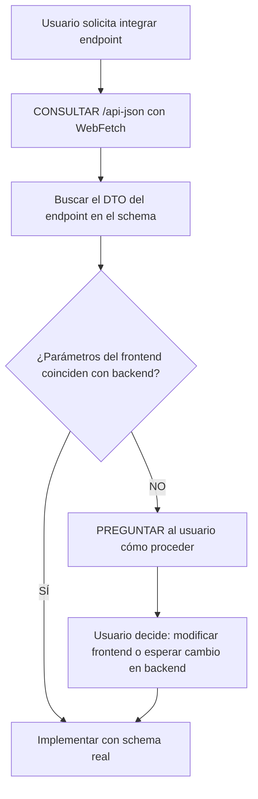

# BeweOS API Gateway Documentation

## Fuente de Documentación

La documentación del API Gateway está disponible en formato **Swagger/OpenAPI**.

### URL de Documentación

| Entorno | URL Swagger UI |
|---------|----------------|
| QA | `https://api-gateway-qa.beweos.io/api#/` |
| Base URL | Definida en `REACT_APP_BASE_URL_BACKEND` en `.env` |

### Cómo Acceder

1. **Swagger UI**: Navega a `{REACT_APP_BASE_URL_BACKEND}/api#/` para ver la documentación interactiva
2. **OpenAPI JSON**: Disponible en `{REACT_APP_BASE_URL_BACKEND}/api-json` para obtener el schema completo

---

## ⚠️ REGLA CRÍTICA: Consultar /api-json ANTES de Implementar

> **OBLIGATORIO**: El agente DEBE consultar `https://api-gateway-qa.beweos.io/api-json` usando la herramienta WebFetch ANTES de implementar cualquier integración con un endpoint. NUNCA asumir parámetros basándose en ejemplos o código existente.

### Flujo Obligatorio



### Checklist de Información Requerida

Antes de escribir código para un endpoint, verifica que tienes:

| Información | Descripción | Requerido |
|-------------|-------------|-----------|
| **Request Body Schema** | Propiedades disponibles, tipos de datos, campos obligatorios vs opcionales | ✅ SÍ |
| **Query Parameters** | Parámetros de URL si aplica (GET requests) | ✅ SÍ |
| **Path Parameters** | Parámetros en la ruta (ej: `/users/:id`) | ✅ SÍ |
| **Response Schema (Success)** | Estructura de respuesta exitosa (200, 201, etc.) | ✅ SÍ |
| **Response Schema (Error)** | Estructura de errores posibles (400, 401, 404, 500) | ✅ SÍ |
| **Headers Requeridos** | Authorization, Content-Type, custom headers | ✅ SÍ |

### Cómo Encontrar el Schema de un Endpoint

1. Consultar `/api-json` con WebFetch
2. Buscar el path del endpoint en `paths`
3. Encontrar el `$ref` del requestBody que apunta a `#/components/schemas/{DtoName}`
4. Buscar el DTO en `components.schemas.{DtoName}`
5. Verificar `properties` y `required` del DTO

### Ejemplo: POST /users/recovery-password

Según el schema real en `/api-json`:

```
Endpoint: POST /users/recovery-password
DTO: SendRecoveryPasswordDto

Request Body:
{
  "agencyId": string (required) - ID de la agencia
  "companyId": string (optional) - ID de la empresa
  "email": string (required) - Email del usuario
}

Response Success (201):
Respuesta estándar del sistema
```

---

## Manejo de Incongruencias Frontend vs Backend

> **IMPORTANTE**: Si los parámetros que el frontend envía actualmente NO coinciden con lo que el backend espera, el agente DEBE preguntar al usuario antes de implementar.

### Formato de Pregunta al Usuario

```
⚠️ INCONGRUENCIA DETECTADA

El endpoint `{ENDPOINT}` según el API Gateway espera:
- Parámetros requeridos: {lista de parámetros del backend}
- Parámetros opcionales: {lista de parámetros opcionales}

El frontend actualmente envía:
- Parámetros: {lista de parámetros del frontend}

¿Cómo deseas proceder?
1. **Modificar el frontend** para enviar los parámetros correctos
2. **El backend se actualizará** para aceptar los parámetros actuales del frontend
3. **Otra solución**: (especificar)

Si eliges la opción 1, necesito saber de dónde obtener los nuevos parámetros (ej: ¿de dónde viene el agencyId?).
```

---

## Preguntas a Hacer al Usuario si Falta Información

Si el usuario solicita implementar un endpoint pero no se puede acceder al `/api-json`, usar este formato:

```
Para implementar correctamente el endpoint `{ENDPOINT}`, necesito la siguiente información:

1. **Request Body**: ¿Cuáles son las propiedades que se envían en el body?
   - Nombre de cada propiedad
   - Tipo de dato (string, number, boolean, object, array)
   - ¿Es obligatorio u opcional?

2. **Response Success**: ¿Cuál es la estructura de respuesta exitosa?
   - Ejemplo de respuesta JSON

3. **Response Error**: ¿Cuáles son los posibles errores?
   - Códigos de error
   - Estructura del error

Puedes consultar esta información en Swagger UI:
https://api-gateway-qa.beweos.io/api-json
```

---

## Uso de la Documentación

### Consultar Endpoints

Cuando necesites información sobre un endpoint específico:

1. Accede al Swagger UI usando la URL base
2. Busca por el controlador o tag del módulo
3. Revisa los parámetros, body, y responses documentados

### Integración Futura

> **Nota**: En el futuro se implementará un MCP (Model Context Protocol) server para acceder a la documentación del API Gateway directamente desde el agente. Mientras tanto, consulta el Swagger UI manualmente.

## Patrones de Request

### Estructura Base de Llamadas

```typescript
import { httpService } from "@http";

// GET request
const response = await httpService.get<ResponseType>('/endpoint');

// POST request
const response = await httpService.post<ResponseType>('/endpoint', data);

// PUT request
const response = await httpService.put<ResponseType>('/endpoint', data);

// PATCH request
const response = await httpService.patch<ResponseType>('/endpoint', data);

// DELETE request
const response = await httpService.delete<ResponseType>('/endpoint');
```

### Manejo de Respuestas

El `httpService` retorna `IResponseApi<T>`:

```typescript
interface IResponseApi<T> {
  success: boolean;
  data?: T;
  error?: {
    code: string;
    message: string;
  };
  message?: string;
}

// Uso en adapter con Result pattern
const response = await httpService.get<DataDto>('/endpoint');

if (response.success && response.data) {
  return Result.Ok(DataMapper.toDomain(response.data));
}

return Result.Err(new GetDataError(response.error?.message || 'Failed'));
```

### Headers Comunes

El `httpService` maneja automáticamente:

| Header | Manejo |
|--------|--------|
| `Authorization` | Añadido automáticamente con Bearer token |
| `Content-Type` | `application/json` por defecto (FormData se maneja especialmente) |

Para headers adicionales:

```typescript
const response = await httpService.get<T>('/endpoint', {
  headers: { 'X-Custom-Header': 'value' }
});
```

## Workflow de Consulta

Cuando trabajes con el API Gateway:

1. **Identifica el módulo**: Determina qué funcionalidad necesitas (auth, users, etc.)
2. **Consulta Swagger**: Navega a la URL del Swagger y busca el tag/controlador
3. **Revisa el contrato**: Verifica request params, body schema, y response types
4. **Implementa**: Usa los tipos y estructuras documentadas

## Recursos

- **Swagger UI**: `https://api-gateway-qa.beweos.io/api-json/`
- **HTTP Service**: `import { httpService } from "@http"` → `@shared/infrastructure/services/api-http.service.ts`
- **Variable de entorno**: `REACT_APP_BASE_URL_BACKEND` (manejada internamente por httpService)
